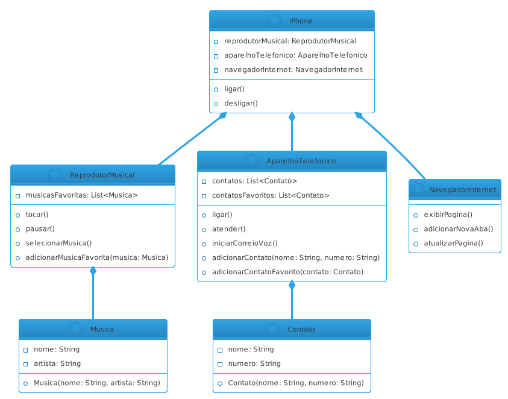

## DIO - Bootcamp JAVA BACKEND 2023

O projeto em questão é uma implementação simples de um sistema de simulação de um iPhone, com funcionalidades básicas como um reprodutor de música, um aparelho telefônico e um navegador na internet, conforme proposto pelo bootcamp.

 
A estrutura de diretórios do projeto é organizada da seguinte forma:

- src/
  - br/
    - com/
      - diobootcamp/
        - iphone/
          - Model/
            - Contato.java
            - Musica.java
          - AparelhoTelefonico.java
          - iPhone.java
          - App.java
          - ReprodutorMusical.java
- README.md
## ESTRUTURA
  `src/br/com/diobootcamp/iphone/Model/:` Contém as classes Contato e Musica que representam os modelos de contato e música.

`src/br/com/diobootcamp/iphone/:` Contém as classes principais do projeto, incluindo AparelhoTelefonico, iPhone, App (classe de execução principal) e ReprodutorMusical.
#
## FUNCIONALIDADES
- Reprodutor Musical: ReprodutorMusical é responsável pela reprodução de músicas.
- Permite adicionar músicas favoritas.
- Permite tocar, pausar e selecionar músicas.
- As músicas favoritas são armazenadas na lista de reprodução.
- Aparelho Telefônico: AparelhoTelefonico representa a funcionalidade de telefone.
- Permite adicionar contatos favoritos.
- Permite fazer ligações, atender chamadas e iniciar correio de voz.
- Os contatos favoritos são armazenados no próprio telefone.
- Navegador na Internet: NavegadorInternet simula um navegador de internet.
- Permite exibir páginas, adicionar novas abas e atualizar páginas.
- Mantém um registro de abas abertas.
#
## Para rodar o projeto, siga estas etapas:

Certifique-se de ter o Java Development Kit (JDK) instalado em seu sistema.

Clone o repositório para o seu computador local: 

`git clone[ https://github.com/seu-usuario/nome-do-repositorio.git](https://github.com/tavvarez/iPhone-DIO-Bootcamp-JAVA.git)`

Navegue até o diretório do projeto e execute:

`javac -d bin src/br/com/diobootcamp/iphone/_.java src/br/com/diobootcamp/iphone/Model/_.java`

Execute o programa principal:

`java -cp bin br.com.diobootcamp.iphone.App`

Isso iniciará a simulação do iPhone e você poderá interagir com as funcionalidades, como adicionar músicas favoritas e contatos, bem como listar contatos favoritos.

## DIAGRAMA DE CLASSES UML

## Contribuições
Sinta-se à vontade para contribuir para este projeto aberto, fazendo pull requests, relatando problemas ou propondo melhorias. Seu feedback é bem-vindo!

